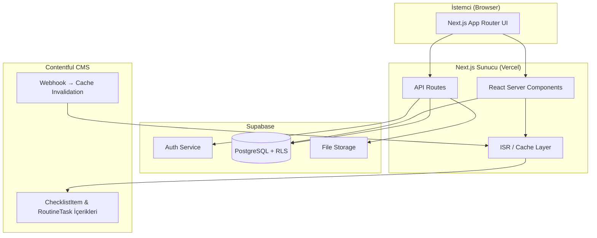
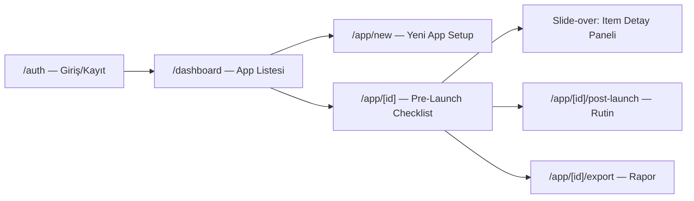
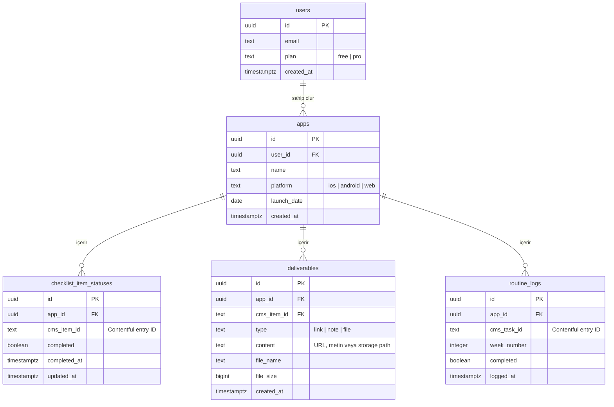

# Teknik Tasarım Dokümanı: Lalalaunchboard

## Genel Bakış

Lalalaunchboard, indie ve başlangıç seviyesindeki geliştiricilerin mobil/web uygulama pazarlama süreçlerini uçtan uca yönetmesini sağlayan bir web uygulamasıdır. Sistem; pre-launch checklist yönetimi, deliverable takibi, progress izleme, post-launch haftalık rutin şablonları ve raporlama işlevlerini tek bir platformda sunar.

### Temel Hedefler

- Geliştiricilerin lansman öncesi süreçlerini yapılandırılmış bir checklist ile yönetmesini sağlamak
- CMS tabanlı içerik yönetimi ile checklist içeriğini kod değişikliği gerektirmeden güncelleyebilmek
- Free (1 uygulama) ve Pro (sınırsız uygulama) plan modeliyle sürdürülebilir bir SaaS yapısı kurmak
- PDF ve Markdown export ile ekip/yatırımcı paylaşımını kolaylaştırmak

### Teknoloji Seçimleri

| Katman | Teknoloji | Gerekçe |
|---|---|---|
| Frontend | Next.js 14 (App Router) | SSR/SSG desteği, file-based routing, React Server Components |
| Backend | Next.js API Routes + Supabase | Supabase; auth, DB, storage ve realtime'ı tek pakette sunar |
| Veritabanı | PostgreSQL (Supabase) | İlişkisel veri modeli, RLS ile satır düzeyinde güvenlik |
| Auth | Supabase Auth | Email/şifre akışı, oturum yönetimi, JWT |
| CMS | Contentful (Headless CMS) | İçerik editörü dostu arayüz, REST + GraphQL API, webhook desteği |
| Dosya Depolama | Supabase Storage | Deliverable dosyaları için, 10 MB limit uygulanabilir |
| PDF Export | react-pdf / @react-pdf/renderer | Sunucu tarafında PDF oluşturma |
| Stil | Tailwind CSS + shadcn/ui | Hızlı prototipleme, tutarlı bileşen kütüphanesi |
| Deployment | Vercel | Next.js ile native entegrasyon, edge functions |

---

## Mimari

### Yüksek Seviye Mimari



### Veri Akışı

1. **Auth Akışı**: Kullanıcı → Next.js API Route → Supabase Auth → JWT Cookie → RLS ile DB erişimi
2. **CMS İçerik Akışı**: Contentful → Next.js ISR Cache (24 saat TTL) → Client
3. **Checklist Akışı**: Client → API Route → Supabase DB (RLS korumalı) → Realtime güncelleme
4. **Export Akışı**: Client → API Route → DB'den veri çek → PDF/MD oluştur → Stream response

### Güvenlik Katmanları

- **Supabase RLS (Row Level Security)**: Her tablo için `auth.uid() = user_id` politikası; kullanıcılar yalnızca kendi verilerine erişebilir
- **CAPTCHA**: Kayıt formunda hCaptcha entegrasyonu (Supabase Auth ile native destek)
- **API Route Koruması**: Her API route'da `getServerSession()` ile oturum doğrulaması
- **Plan Kontrolü**: App oluşturma endpoint'inde Free Plan limiti server-side kontrol edilir

---

## Bileşenler ve Arayüzler

### Ekran Haritası



### Bileşen Ağacı

```
app/
├── (auth)/
│   └── auth/page.tsx              # Giriş + Kayıt sekmeleri
├── (app)/
│   ├── dashboard/page.tsx         # App listesi + yeni app butonu
│   ├── app/
│   │   ├── new/page.tsx           # Onboarding formu
│   │   └── [id]/
│   │       ├── page.tsx           # Pre-Launch Checklist
│   │       ├── post-launch/page.tsx
│   │       └── export/page.tsx
└── components/
    ├── auth/
    │   ├── LoginForm.tsx
    │   └── RegisterForm.tsx
    ├── dashboard/
    │   ├── AppCard.tsx
    │   └── AppList.tsx
    ├── checklist/
    │   ├── ChecklistCategory.tsx
    │   ├── ChecklistItem.tsx
    │   ├── ItemDetailPanel.tsx     # Slide-over
    │   ├── DeliverableForm.tsx
    │   └── ProgressBar.tsx
    ├── post-launch/
    │   ├── RoutineWeekView.tsx
    │   └── RoutineTaskItem.tsx
    └── shared/
        ├── CountdownBadge.tsx
        └── ExportButton.tsx
```

### API Arayüzleri

#### Auth Endpoint'leri (Supabase Auth SDK üzerinden)

```
POST /auth/sign-up     → { email, password, captchaToken }
POST /auth/sign-in     → { email, password }
POST /auth/sign-out    → {}
```

#### App (Workspace) Endpoint'leri

```
GET    /api/apps              → App[]
POST   /api/apps              → { name, platform, launchDate } → App
DELETE /api/apps/[id]         → 204
PATCH  /api/apps/[id]         → { launchDate? } → App
```

#### Checklist Endpoint'leri

```
GET  /api/apps/[id]/checklist          → ChecklistItemWithStatus[]
PATCH /api/apps/[id]/checklist/[itemId] → { completed: boolean } → ChecklistItemStatus
```

#### Deliverable Endpoint'leri

```
GET    /api/apps/[id]/checklist/[itemId]/deliverables  → Deliverable[]
POST   /api/apps/[id]/checklist/[itemId]/deliverables  → { type, content } → Deliverable
DELETE /api/apps/[id]/deliverables/[deliverableId]     → 204
```

#### Post-Launch Endpoint'leri

```
GET   /api/apps/[id]/routine              → RoutineTask[]
GET   /api/apps/[id]/routine/logs?week=N  → RoutineLog[]
POST  /api/apps/[id]/routine/logs         → { taskId, weekNumber, completed } → RoutineLog
```

#### Export Endpoint'leri

```
GET /api/apps/[id]/export?format=pdf      → application/pdf (stream)
GET /api/apps/[id]/export?format=markdown → text/markdown (stream)
```

#### CMS Endpoint'leri (Contentful → Next.js Cache)

```
GET /api/cms/checklist-items   → CmsChecklistItem[] (ISR, 24h TTL)
GET /api/cms/routine-tasks     → CmsRoutineTask[]   (ISR, 24h TTL)
POST /api/cms/revalidate       → Contentful webhook handler → cache invalidation
```

---

## Veri Modelleri

### Veritabanı Şeması (PostgreSQL / Supabase)



### TypeScript Tip Tanımları

```typescript
// Veritabanı tipleri
type Plan = 'free' | 'pro';
type Platform = 'ios' | 'android' | 'web';
type DeliverableType = 'link' | 'note' | 'file';

interface User {
  id: string;
  email: string;
  plan: Plan;
  created_at: string;
}

interface App {
  id: string;
  user_id: string;
  name: string;
  platform: Platform;
  launch_date: string; // ISO date
  created_at: string;
}

interface ChecklistItemStatus {
  id: string;
  app_id: string;
  cms_item_id: string;
  completed: boolean;
  completed_at: string | null;
  updated_at: string;
}

interface Deliverable {
  id: string;
  app_id: string;
  cms_item_id: string;
  type: DeliverableType;
  content: string;
  file_name?: string;
  file_size?: number;
  created_at: string;
}

interface RoutineLog {
  id: string;
  app_id: string;
  cms_task_id: string;
  week_number: number;
  completed: boolean;
  logged_at: string;
}

// CMS tipleri (Contentful'dan gelen)
interface CmsChecklistItem {
  id: string;           // Contentful entry ID
  title: string;
  description: string;
  category: 'store_prep' | 'aso' | 'creative' | 'legal';
  guideText: string;
  toolLinks: { label: string; url: string }[];
  order: number;
}

interface CmsRoutineTask {
  id: string;
  title: string;
  description: string;
  frequency: 'weekly';
  order: number;
}

// Birleşik (composite) tipler — UI katmanında kullanılır
interface ChecklistItemWithStatus extends CmsChecklistItem {
  status: ChecklistItemStatus | null;
  deliverables: Deliverable[];
}

interface WorkspaceProgress {
  overall: number;           // 0-100
  byCategory: Record<string, number>;
  completedCount: number;
  totalCount: number;
}
```

### RLS Politikaları

```sql
-- users tablosu
CREATE POLICY "users_read_own_profile" ON users
  FOR SELECT USING (auth.uid() = id);

-- apps tablosu
CREATE POLICY "users_own_apps" ON apps
  FOR ALL USING (auth.uid() = user_id);

-- checklist_item_statuses tablosu
CREATE POLICY "users_own_statuses" ON checklist_item_statuses
  FOR ALL USING (
    app_id IN (SELECT id FROM apps WHERE user_id = auth.uid())
  );

-- deliverables tablosu
CREATE POLICY "users_own_deliverables" ON deliverables
  FOR ALL USING (
    app_id IN (SELECT id FROM apps WHERE user_id = auth.uid())
  );

-- routine_logs tablosu
CREATE POLICY "users_own_logs" ON routine_logs
  FOR ALL USING (
    app_id IN (SELECT id FROM apps WHERE user_id = auth.uid())
  );
```

Not: `users.plan` değeri istemci tarafından güncellenmez; plan değişiklikleri sadece server-side süreçler üzerinden yapılır. Ayrıca `routine_logs` için aynı `app_id + cms_task_id + week_number` kombinasyonu yalnızca bir kez kaydedilmelidir.

### CMS İçerik Önbellekleme Stratejisi

- Next.js `fetch()` ile `revalidate: 86400` (24 saat) ISR cache
- Contentful webhook → `POST /api/cms/revalidate` → `revalidatePath()` ile anında invalidation
- CMS erişilemez olduğunda: `unstable_cache` ile son başarılı yanıt korunur, kullanıcıya bilgi mesajı gösterilir

### Plan Limiti Kontrolü

```typescript
// Server-side plan kontrolü (API Route)
async function checkAppLimit(userId: string): Promise<boolean> {
  const { data: user } = await supabase
    .from('users').select('plan').eq('id', userId).single();
  
  if (user.plan === 'pro') return true;
  
  const { count } = await supabase
    .from('apps').select('*', { count: 'exact' })
    .eq('user_id', userId);
  
  return count === 0; // Free: sadece 0 app varsa yeni oluşturulabilir
}
```

### Progress Hesaplama

```typescript
function calculateProgress(
  items: CmsChecklistItem[],
  statuses: ChecklistItemStatus[]
): WorkspaceProgress {
  const completedIds = new Set(
    statuses.filter(s => s.completed).map(s => s.cms_item_id)
  );

  const byCategory: Record<string, number> = {};
  const categories = ['store_prep', 'aso', 'creative', 'legal'];

  for (const cat of categories) {
    const catItems = items.filter(i => i.category === cat);
    const catCompleted = catItems.filter(i => completedIds.has(i.id)).length;
    byCategory[cat] = catItems.length > 0
      ? Math.round((catCompleted / catItems.length) * 100)
      : 0;
  }

  const overall = items.length > 0
    ? Math.round((completedIds.size / items.length) * 100)
    : 0;

  return {
    overall,
    byCategory,
    completedCount: completedIds.size,
    totalCount: items.length,
  };
}
```

### Export Dosya Adı Formatı

```typescript
function buildExportFileName(appName: string, format: 'pdf' | 'md'): string {
  const slug = appName
    .toLowerCase()
    .replace(/\s+/g, '-')
    .replace(/[^a-z0-9-]/g, '');
  return `${slug}-pre-launch-raporu.${format}`;
}
```


---

## Doğruluk Özellikleri (Correctness Properties)

*Bir özellik (property), sistemin tüm geçerli çalışmalarında doğru olması gereken bir karakteristik veya davranıştır — temelde sistemin ne yapması gerektiğine dair biçimsel bir ifadedir. Özellikler, insan tarafından okunabilir spesifikasyonlar ile makine tarafından doğrulanabilir doğruluk garantileri arasındaki köprüyü oluşturur.*

---

### Özellik 1: CAPTCHA Olmadan Kayıt Reddedilir

*Herhangi bir* email ve şifre kombinasyonu için, CAPTCHA token olmadan gönderilen kayıt isteği sistem tarafından reddedilmeli ve kullanıcı kaydı oluşturulmamalıdır.

**Doğrular: Gereksinim 1.2**

---

### Özellik 2: Şifre Uzunluğu Doğrulaması

*Herhangi bir* 1 ile 7 karakter arasındaki şifre string'i için, kayıt isteği sistem tarafından reddedilmeli ve "Şifre en az 8 karakter olmalıdır" hata mesajı gösterilmelidir.

**Doğrular: Gereksinim 1.6**

---

### Özellik 3: Şifre Eşleşme Doğrulaması

*Herhangi iki* farklı string için (şifre ve şifre tekrarı), kayıt isteği sistem tarafından reddedilmeli ve "Şifreler eşleşmiyor" hata mesajı gösterilmelidir.

**Doğrular: Gereksinim 1.5**

---

### Özellik 4: Duplicate Email Reddedilir

*Herhangi bir* email adresi için, sistemde zaten kayıtlı olan aynı email ile yapılan kayıt girişimi reddedilmeli ve "Bu email adresi zaten kullanımda" hata mesajı gösterilmelidir.

**Doğrular: Gereksinim 1.4**

---

### Özellik 5: Auth Round-Trip (Kayıt → Giriş)

*Herhangi bir* geçerli email ve 8+ karakter şifre kombinasyonu için, kayıt işlemi başarıyla tamamlandıktan sonra aynı kimlik bilgileriyle giriş yapılabilmeli; geçersiz kimlik bilgileriyle yapılan giriş girişimi ise reddedilmelidir.

**Doğrular: Gereksinim 1.3, 2.1, 2.2**

---

### Özellik 6: Çıkış Sonrası Oturum Temizlenir

*Herhangi bir* aktif oturum için, çıkış işlemi sonrasında oturum bilgileri temizlenmeli ve korumalı sayfalara erişim reddedilmelidir.

**Doğrular: Gereksinim 2.4**

---

### Özellik 7: App Oluşturma Round-Trip

*Herhangi bir* geçerli uygulama adı, platform ve lansman tarihi kombinasyonu için, app oluşturma işlemi başarıyla tamamlandıktan sonra oluşturulan app Dashboard listesinde görünmelidir.

**Doğrular: Gereksinim 3.2, 3.5**

---

### Özellik 8: Plan Limiti Koruması

*Herhangi bir* Free Plan kullanıcısı için, zaten 1 app'i varken ikinci bir app oluşturma girişimi reddedilmelidir. *Herhangi bir* Pro Plan kullanıcısı için ise N adet app oluşturulabilmelidir (N ≥ 2).

**Doğrular: Gereksinim 3.3, 3.4**

---

### Özellik 9: App Silme Sonrası Erişilemezlik

*Herhangi bir* app için, silme işlemi onaylandıktan sonra o app'e ait tüm veriler (checklist durumları, deliverable'lar, routine log'lar) artık sorgulanabilir olmamalıdır.

**Doğrular: Gereksinim 3.6**

---

### Özellik 10: CMS İçerik Round-Trip

*Herhangi bir* CMS'te tanımlı ChecklistItem veya RoutineTask için, ilgili workspace'in checklist/rutin ekranında o item'ın başlık ve kategori bilgisi görünmelidir.

**Doğrular: Gereksinim 4.2, 8.1, 10.1, 10.2**

---

### Özellik 11: Checklist Toggle Round-Trip

*Herhangi bir* ChecklistItem için, "tamamlandı" olarak işaretlenip ardından işaret kaldırıldığında item'ın durumu başlangıç durumuna (tamamlanmadı) dönmeli ve Progress değeri buna göre yeniden hesaplanmalıdır.

**Doğrular: Gereksinim 4.3, 4.4**

---

### Özellik 12: Progress Hesaplama Doğruluğu

*Herhangi bir* checklist durumu kümesi için, genel progress yüzdesi `round(tamamlanan / toplam * 100)` formülüyle hesaplanmalı; her kategori için de aynı formül kategori bazında uygulanmalıdır.

**Doğrular: Gereksinim 6.1, 6.4, 4.5**

---

### Özellik 13: Deliverable Round-Trip

*Herhangi bir* ChecklistItem için, eklenen bir Deliverable (link, not veya dosya) Item Detay Panelinde listelenmelidir; silme işlemi onaylandıktan sonra ise artık listede görünmemelidir.

**Doğrular: Gereksinim 5.2, 5.5, 5.6**

---

### Özellik 14: URL Doğrulaması

*Herhangi bir* geçersiz URL formatındaki string için (http:// veya https:// ile başlamayan, alan adı içermeyen vb.), link Deliverable ekleme girişimi reddedilmeli ve "Geçerli bir URL giriniz" hata mesajı gösterilmelidir.

**Doğrular: Gereksinim 5.3**

---

### Özellik 15: Dosya Boyutu Sınırı

*Herhangi bir* 10 MB'dan büyük dosya için, dosya Deliverable yükleme girişimi reddedilmeli ve "Dosya boyutu 10 MB'ı geçemez" hata mesajı gösterilmelidir.

**Doğrular: Gereksinim 5.4**

---

### Özellik 16: Countdown Hesaplama Doğruluğu

*Herhangi bir* gelecekteki lansman tarihi için, countdown değeri `ceil(launchDate - today)` gün sayısına eşit olmalıdır. Tarih güncellendiğinde countdown yeni tarihe göre yeniden hesaplanmalıdır. Geçmiş tarih için "Lansman tarihi geçti" uyarısı gösterilmelidir (edge-case).

**Doğrular: Gereksinim 7.1, 7.2, 7.3, 7.4**

---

### Özellik 17: RoutineLog Round-Trip

*Herhangi bir* RoutineTask ve hafta numarası kombinasyonu için, task tamamlandı olarak işaretlendiğinde o haftaya ait bir RoutineLog kaydı oluşturulmalı; geçmiş hafta görüntülendiğinde bu log'un tamamlanma durumu doğru gösterilmelidir.

**Doğrular: Gereksinim 8.2, 8.3, 8.4**

---

### Özellik 18: Export İçerik Bütünlüğü

*Herhangi bir* workspace için, PDF veya Markdown formatında oluşturulan export dosyası; workspace adını, genel progress yüzdesini, tüm ChecklistItem'ların tamamlanma durumlarını ve Deliverable listesini içermelidir.

**Doğrular: Gereksinim 9.2, 9.3**

---

### Özellik 19: Export Dosya Adı Formatı

*Herhangi bir* uygulama adı için, export dosyasının adı `{slug}-pre-launch-raporu.{format}` formatında olmalıdır; burada slug, uygulama adının küçük harfe dönüştürülmüş ve boşlukların tire ile değiştirilmiş halidir.

**Doğrular: Gereksinim 9.4**

---

## Hata Yönetimi

### Hata Kategorileri ve Yanıtları

| Kategori | Durum | Kullanıcıya Gösterilen Mesaj | HTTP Kodu |
|---|---|---|---|
| Auth | Duplicate email | "Bu email adresi zaten kullanımda" | 409 |
| Auth | Hatalı kimlik bilgileri | "Email veya şifre hatalı" | 401 |
| Auth | CAPTCHA başarısız | "Lütfen CAPTCHA doğrulamasını tamamlayın" | 400 |
| Validasyon | Şifre çok kısa | "Şifre en az 8 karakter olmalıdır" | 400 |
| Validasyon | Şifre eşleşmiyor | "Şifreler eşleşmiyor" | 400 |
| Validasyon | Geçersiz URL | "Geçerli bir URL giriniz" | 400 |
| Validasyon | Dosya çok büyük | "Dosya boyutu 10 MB'ı geçemez" | 400 |
| Plan Limiti | Free plan aşıldı | "Pro Plan'a geçerek sınırsız uygulama ekleyebilirsiniz" | 403 |
| Yetkilendirme | Yetkisiz erişim | "Bu kaynağa erişim yetkiniz yok" | 403 |
| CMS | CMS erişilemez | "İçerik güncelleniyor, önbellekten sunuluyor" | — (bilgi) |
| Export | Export başarısız | "Export işlemi başarısız oldu, lütfen tekrar deneyin" | 500 |
| Genel | Beklenmeyen hata | "Bir hata oluştu, lütfen sayfayı yenileyin" | 500 |

### Hata Yönetimi Stratejisi

**Client-Side Validasyon**: Form submit öncesinde şifre uzunluğu, eşleşme, URL formatı ve dosya boyutu kontrolleri yapılır. Kullanıcıya anlık geri bildirim sağlanır.

**Server-Side Validasyon**: Tüm API route'larında Zod şema validasyonu uygulanır. Client-side validasyonu bypass eden istekler server'da da reddedilir.

**CMS Fallback**: `try/catch` ile Contentful API çağrısı sarılır. Hata durumunda `unstable_cache` ile önbellekten servis edilir, kullanıcıya bilgi toast'u gösterilir.

**Export Hataları**: PDF/Markdown oluşturma işlemi `try/catch` ile sarılır. Hata durumunda 500 yanıtı ve kullanıcıya toast mesajı döner.

**Supabase RLS İhlalleri**: RLS politikası ihlallerinde Supabase 403 döner; API route bu hatayı yakalar ve kullanıcıya genel yetkilendirme hatası mesajı gösterir.

---

## Test Stratejisi

### Çift Katmanlı Test Yaklaşımı

Sistem hem **birim/entegrasyon testleri** hem de **özellik tabanlı testler (property-based testing)** ile doğrulanır. Bu iki yaklaşım birbirini tamamlar:

- **Birim/Entegrasyon Testleri**: Belirli örnekleri, edge case'leri ve hata koşullarını doğrular
- **Özellik Tabanlı Testler**: Evrensel özellikleri rastgele üretilen girdiler üzerinde doğrular

### Özellik Tabanlı Test Konfigürasyonu

**Kütüphane**: `fast-check` (TypeScript/JavaScript için)

```bash
npm install --save-dev fast-check
```

**Minimum iterasyon**: Her özellik testi için en az 100 iterasyon çalıştırılmalıdır.

**Etiket formatı**: Her test, ilgili tasarım özelliğine referans veren bir yorum içermelidir:
```
// Feature: pre-post-launch-os, Property {N}: {özellik_metni}
```

**Her doğruluk özelliği tek bir özellik tabanlı test ile implemente edilmelidir.**

### Özellik Tabanlı Test Örnekleri

```typescript
import fc from 'fast-check';

// Feature: pre-post-launch-os, Property 2: Şifre uzunluğu doğrulaması
test('1-7 karakter arası şifreler reddedilir', () => {
  fc.assert(
    fc.property(
      fc.string({ minLength: 1, maxLength: 7 }),
      (password) => {
        const result = validatePassword(password);
        return result.valid === false && result.error === 'Şifre en az 8 karakter olmalıdır';
      }
    ),
    { numRuns: 100 }
  );
});

// Feature: pre-post-launch-os, Property 12: Progress hesaplama doğruluğu
test('Progress yüzdesi doğru hesaplanır', () => {
  fc.assert(
    fc.property(
      fc.array(fc.boolean(), { minLength: 1, maxLength: 50 }),
      (completionStates) => {
        const total = completionStates.length;
        const completed = completionStates.filter(Boolean).length;
        const expected = Math.round((completed / total) * 100);
        const result = calculateProgress(completionStates);
        return result.overall === expected;
      }
    ),
    { numRuns: 100 }
  );
});

// Feature: pre-post-launch-os, Property 19: Export dosya adı formatı
test('Export dosya adı doğru formatlanır', () => {
  fc.assert(
    fc.property(
      fc.string({ minLength: 1 }),
      fc.constantFrom('pdf', 'md' as const),
      (appName, format) => {
        const fileName = buildExportFileName(appName, format);
        return fileName.endsWith(`-pre-launch-raporu.${format}`);
      }
    ),
    { numRuns: 100 }
  );
});
```

### Birim Test Kapsamı

**Öncelikli birim test alanları:**

- `calculateProgress()` — sıfır item, tüm tamamlanmış, hiç tamamlanmamış edge case'leri
- `buildExportFileName()` — özel karakter, Türkçe karakter, boşluk içeren isimler
- `validateUrl()` — geçerli/geçersiz URL örnekleri
- `calculateCountdown()` — bugün, geçmiş tarih, gelecek tarih örnekleri
- CMS fallback davranışı — mock Contentful API ile önbellek testi
- RLS politikaları — farklı kullanıcıların birbirinin verilerine erişememesi

**Entegrasyon test alanları:**

- Auth akışı: kayıt → giriş → çıkış
- App CRUD: oluştur → listele → sil
- Checklist toggle: tamamla → progress güncelle → geri al → progress güncelle
- Deliverable CRUD: ekle → listele → sil
- Export: PDF ve Markdown oluşturma ve indirme

### Test Araçları

| Araç | Kullanım Alanı |
|---|---|
| Vitest | Birim ve entegrasyon testleri |
| fast-check | Özellik tabanlı testler |
| @testing-library/react | React bileşen testleri |
| Playwright | E2E testler (kritik akışlar) |
| MSW (Mock Service Worker) | API mock'lama |
